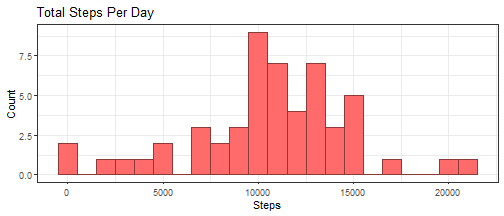
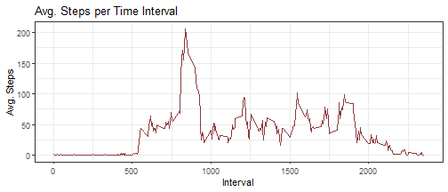
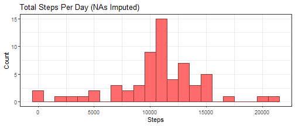
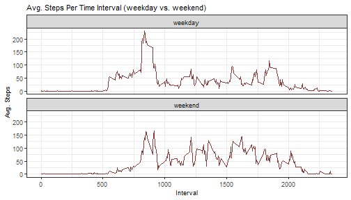

This file gives an overview of data manipulation, exploration, and charting
for the Coursera Reproducible Research week 2 course project.  


## Loading required libraries

First, load the required libraries readr (for loading csv data file as tibble),
dplyr (for data manipulation functions), and ggplot2 (for graphing).


```r
library(readr)
library(dplyr)
library(ggplot2)
```


## Loading and preprocessing the data

Unzip the included data file, activity.zip, and save the csv contained within
to a new directory called "data". Load the csv file to a new tibble object.


```r
if(!file.exists("./data")){dir.create("./data")}
unzip("activity.zip", exdir="./data")
activity <- read_csv("./data/activity.csv")
```

```
## 
## -- Column specification -------------------------------------------------------------
## cols(
##   steps = col_double(),
##   date = col_date(format = ""),
##   interval = col_double()
## )
```


## What is mean total number of steps taken per day?

Use dplyr to summarize steps data by date. Then, with ggplot2, create a histogram of steps per day.


```r
activity %>%
    filter(!is.na(steps)) %>%
    group_by(date) %>%
    summarize(steps_total = sum(steps)) %>%
    ggplot(mapping = aes(x = steps_total)) +
        geom_histogram(binwidth = 1000, 
                       fill = "indianred1", color = "indianred4") + 
        theme_bw() +
        labs(title = "Total Steps per Day", x = "Steps", y = "Count")
```




Calculate the mean and median total number of steps taken per day.


```r
temp <- activity %>%
    filter(!is.na(steps)) %>%
    group_by(date) %>%
    summarize(steps_total = sum(steps))

steps_total_mean <- format(mean(temp$steps_total), scientific = FALSE)
steps_total_median <- format(median(temp$steps_total), scientific = FALSE)
```


The mean steps per day is **10766.19**, and the median steps per day is **10765**.


## What is the average daily activity pattern?

Create a time series plot with the avg. number of steps taken by interval,
averaged across all days.


```r
activity %>%
    filter(!is.na(steps)) %>%
    group_by(interval) %>%
    summarize(steps_mean = mean(steps)) %>%
    ggplot(mapping = aes(x = interval, y = steps_mean)) +
        geom_line(color = "indianred4", size = 0.5) + 
        theme_bw() +
        labs(title = "Avg. Steps per Time Interval",
             x = "Interval", y = "Avg. Steps")
```


  
Calculate the interval with the maximum avg. number of steps.


```r
temp <- activity %>%
    filter(!is.na(steps)) %>%
    group_by(interval) %>%
    summarize(steps_mean = mean(steps))

interval_max <- temp$interval[which.max(temp$steps_mean)]
```


The 5-minute interval with the max avg. number of steps is **835 to
839**.  

## Imputing missing values

Compute the number of missing steps values in the dataset.


```r
missing_steps <- sum(is.na(activity$steps))
```


There are **2304** missing steps values.  


Fill in the missing values using the mean for each 5-minute interval, by 
computing the mean for each interval (among non-missing values) and filling
that in for any missing values. Create a new dataset with the missing data filled in.


```r
activity_imputed <- activity %>%
    group_by(interval) %>%
    mutate(steps_interval_mean = mean(steps, na.rm = TRUE)) %>%
    ungroup() %>%
    mutate(steps = case_when(is.na(steps) ~ steps_interval_mean,
                             !is.na(steps) ~ steps)) %>%
    select(-steps_interval_mean)
```


Create a histogram of the number of steps taken each day using the imputed 
dataset, and calculate the mean and median total number of steps per day.


```r
temp <- activity_imputed %>%
    group_by(date) %>%
    summarize(steps_total = sum(steps))

temp %>%
    ggplot(mapping = aes(x = steps_total)) +
        geom_histogram(binwidth = 1000, 
                       fill = "indianred1", color = "indianred4") + 
        theme_bw() +
        labs(title = "Total Steps per Day (NA's Imputed)",
             x = "Steps", y = "Count")
```



```r
steps_total_mean <- format(mean(temp$steps_total), scientific = FALSE)
steps_total_median <- format(median(temp$steps_total), scientific = FALSE)
```
  

The mean steps per day is **10766.19**, and the median steps per day is **10766.19**. 

The mean steps per day does not differ from the unimputed/original data. The
median steps per day increases slightly, and is now equal to the mean steps
per day.  


## Are there differences in activity patterns between weekdays and weekends?

Create a new factor variable indicating whether a given date is a weekday or
a weekend. Then make a time series plot showing the avg. number of steps taken
per 5-minute interval, with panels for weekday avg. and weekend avg.,
respectively.


```r
activity_imputed <- activity_imputed %>%
    mutate(daytype = as.factor(
           case_when(weekdays(date) == "Monday" ~ "weekday",
                     weekdays(date) == "Tuesday" ~ "weekday",
                     weekdays(date) == "Wednesday" ~ "weekday",
                     weekdays(date) == "Thursday" ~ "weekday",
                     weekdays(date) == "Friday" ~ "weekday",
                     weekdays(date) == "Saturday" ~ "weekend",
                     weekdays(date) == "Sunday" ~ "weekend")))
```


```r
options(dplyr.summarise.inform = FALSE)

activity_imputed %>%
    group_by(daytype, interval) %>%
    summarize(steps_mean = mean(steps)) %>%
    ggplot(mapping = aes(x = interval, y = steps_mean)) +
        geom_line(size = 0.5, color = "indianred4") + 
        facet_wrap( ~ daytype, nrow = 2) +
        theme_bw() +
        theme(title = element_text(size = rel(0.9))) +
        labs(title = "Avg. Steps per Time Interval (weekday vs. weekend)",
             x = "Interval", y = "Avg. Steps")
```




